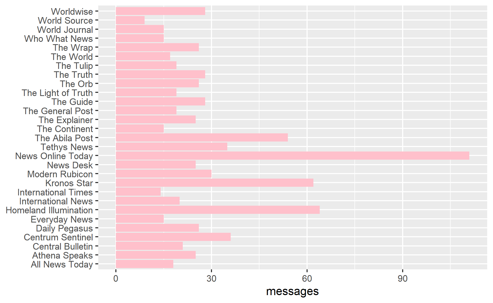
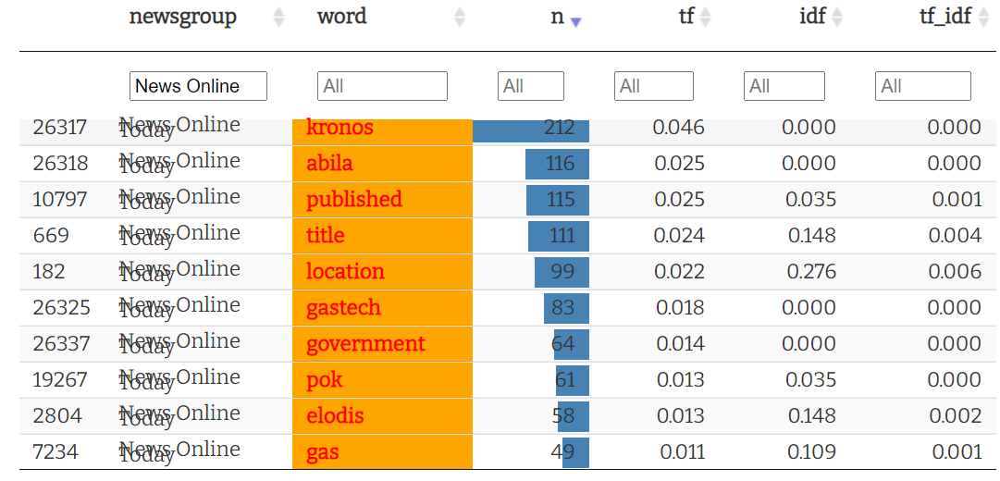
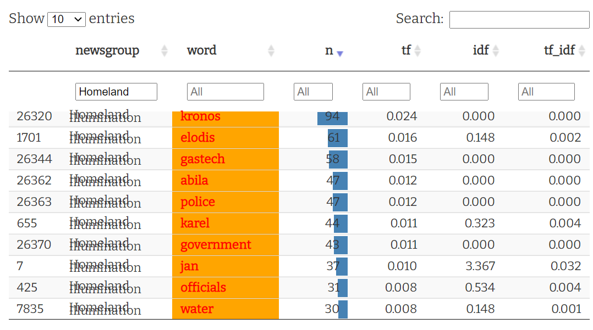
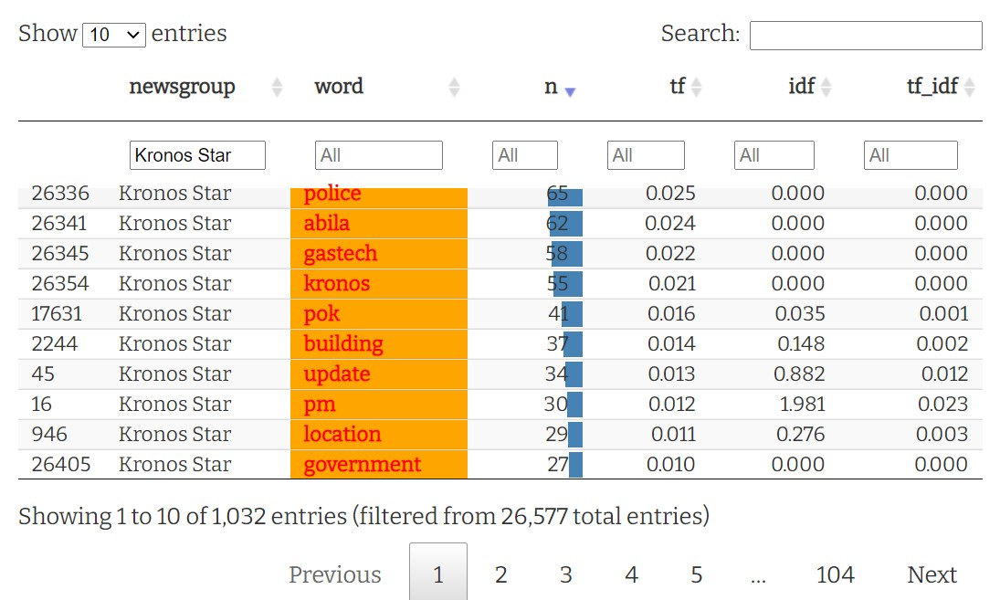
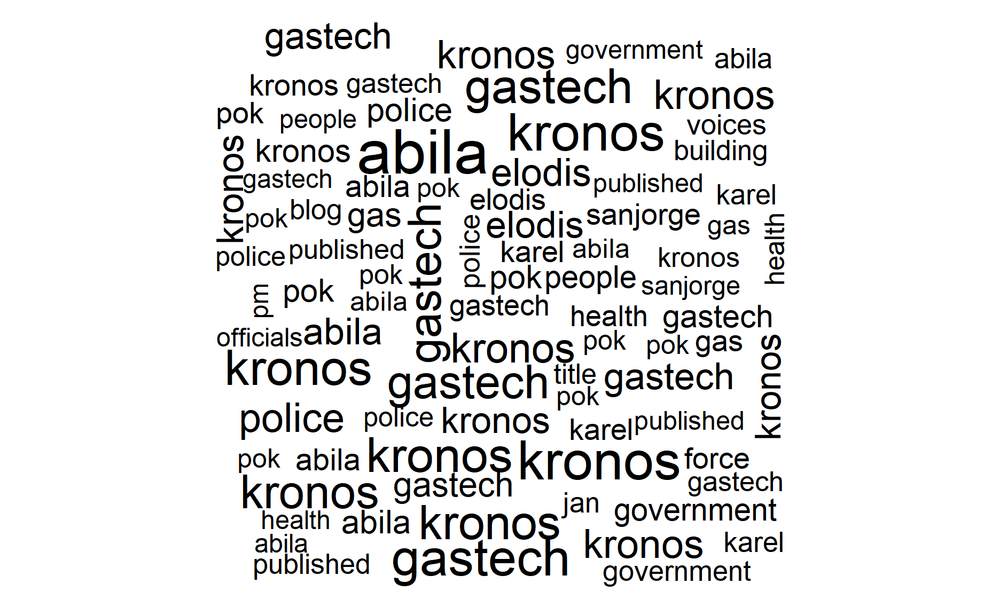
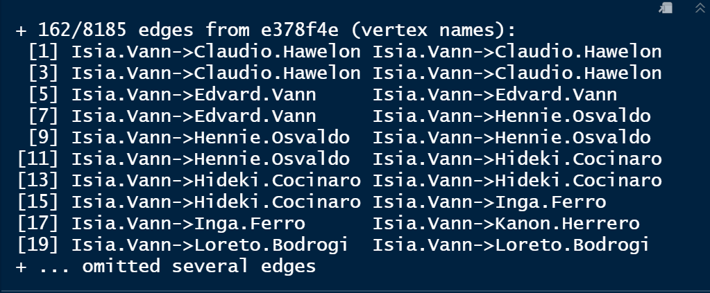

```{r setup, include=FALSE}
knitr::opts_chunk$set(echo = TRUE,
                      fig.align = 'left')
```

I subsetted the News Articles from the start of 2009 to the end of 2014 and then built the frequency chart of messages. From the message figure below, We can find obvious peaks in some news, for example, News Online Today has a much larger number of messages than other news groups, followed by Homeland Illumination, Kronos Star, and The Abila Post. Reading the articles in these news files, especially in News Online Today, we can read that the city government and POK have a disagreement about the cause of death of Elian Karel, an employee from GASTech.




For the top 3 News groups of messages numbers, we can observe the most frequently appearing words from 3 tables below. For example, 'kronos' has appeared 212 times in News Online Today, 94 times in Homeland Illumination, and 55 times in Kronos Star. The word 'kronos' appears most frequently in the 3 groups, so the other terms related to this word should be paid attention to. At the same time, the words ‘government’, ‘pok’, and ‘police’ appear frequently. This provides the right direction for people to analyze the relationship between these institutions or organizations.








The wordcloud of  the 29 News groups gives the High-frequency vocabulary from the news. Visually, 'kronos', 'police', 'government', and 'karel' are more obvious.


In the correlation graph below, the darker the color, the stronger the correlation between these groups.


Through checking, Isia Vann is one of the main subject who worked for GASTech in the security department. Also, he is the brother of one of the people who died of pollution caused by GASTech. The image below indicats that there are 162 edges going to or from Isia Vann. As we know from the given information, Isia Vann is a member of POK, therefore people who has communicated with him may be a potential members of POK network.




Based on the assumption talked above, we can filter the email subjects and receivers that looked suspiciou. From the table above, Loreto.Bodrogi and Hennie.Osvaldo are found are employees with POK.
